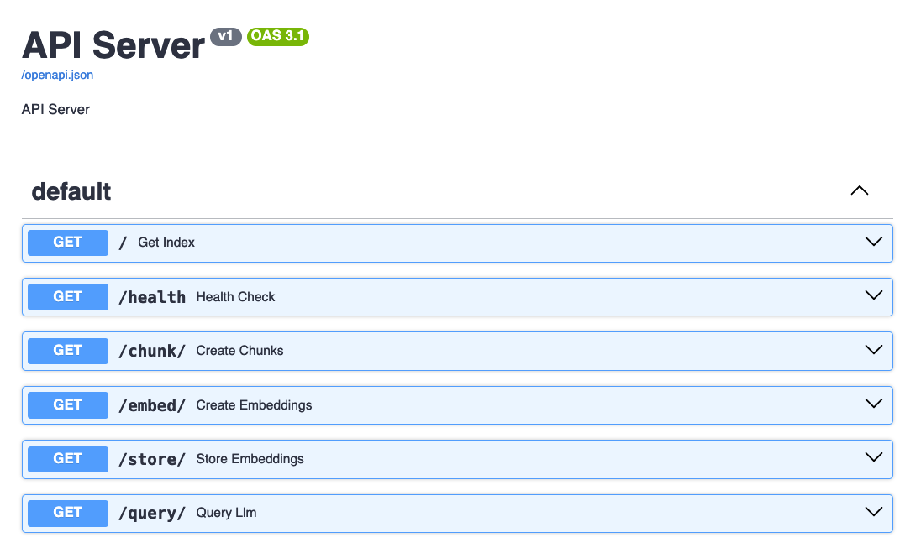
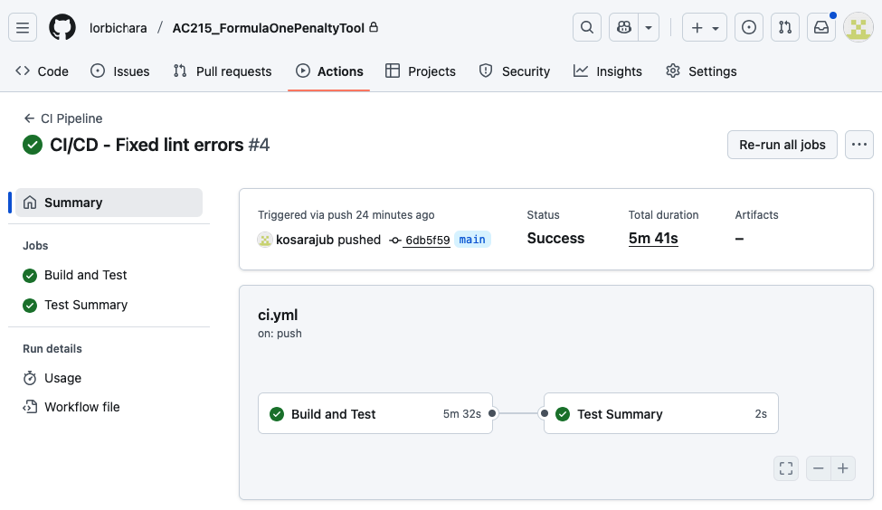

# ac215_FormulaOnePenaltyTool

## Team Members
* Beatrice Chen
* Bhargav Kosaraju
* Lorraine Bichara Assad

## Group Name
Formula One Penalty Tool


## Project Organization

```
├── README.md
├── reports
│   └── Milestone1.pdf
│   └── Milestone3.pdf
└── src
    ├── datapipeline
    │   ├── README.md
    │   ├── Dockerfile
    │   ├── pyproject.toml
    │   ├── uv.lock
    │   ├── requirements.txt
    │   ├── __init__.py
    │   ├── main.py
    │   ├── scraper.py
    │   ├── converter.py
    │   ├── assets
    └── rag
        ├── README.md
        ├── Dockerfile
        ├── pyproject.toml
        ├── uv.lock
        ├── docker-shell.sh
        ├── docker-entrypoint.sh
        ├── docker-compose.yml
        └── ac215_rag.py
        └── assets
```

---

## Project
This project aims to make Formula 1 penalties more transparent and understandable for fans. Governed by the FIA, F1 penalties often appear inconsistent due to the complexity of the Sporting and Technical Regulations. This application takes a given race penalty and provides an accessible explanation of the infringement, referencing the official FIA regulations. It also analyzes the fairness of the penalty by comparing it to historical cases, helping users better grasp how penalties are determined and whether they align with past precedents.

## Milestone 1
See Milestone 1 [here](reports/Milestone1.pdf).

## Milestone 2
In this milestone, we have set up the core infrastrucutre of the project. This include setting up the environment, as well as a data collection pipeline and a RAG setup.

### Data
See [Data Pipeline README](src/datapipeline/README.md) for more details on the data pipeline.

### RAG
See [RAG README](src/rag/README.md) for more details on the RAG set up.

## Milestone 3
See the Milestone 3 midterm presentation [here](reports/Milestone3.pdf).

For this milestone, we applied feedback received in Milestone 2 including:
- Removed data files from GitHub repository
- Add a dedicated folder for reports/documents (MS1 proposal, MS3 midterm presentation)
- Include repository structure in the main README
- Updated the UI mock up, see [here](https://twine-claw-08738571.figma.site)

## Milestone 4
### Application Design
See [Application design doc](reports/Milestone4-ApplicationDesignDocument.pdf) for more details on the application architecture and code organization

### APIs
The backend APIs interact with a **Retrieval-Augmented Generation (RAG)** architecture to process, store, and query information related to F1 penalties and regulations.

The API is served by a Uvicorn web server. The base URL will depend on the deployment environment (e.g., `http://localhost:8000` for local development).


#### **API ENDPOINT: '/'**
This endpoint provides a simple welcome message.

| Method | Endpoint | Description | Response Content Type |
| :--- | :--- | :--- | :--- |
| `GET` | `/` | Welcome message to the API. | `application/json` |

* *Example Response (Status 200):* *
```json
{
  "message": "Welcome to Formula One Penalty Analysis Tool"
}
```
#### **API ENDPOINT: '/chunk'**
This endpoint is used to manage the data processing pipeline, transforming source documents (regulations, etc.) into a searchable vector database.

| Method | Endpoint | Description | Response Content Type |
| :--- | :--- | :--- | :--- |
| 'GET' | '/chunk' | Peforms chunking and returns status string | 'text/html'|

'limit: Specifies the maximum number of documents or chunks to process`

**_Example Request:_**
```http
GET /chunk
```
**_Response Format_**
| Detail | Description |
| :--- | :--- |
| Content Type | `text/html` |
| Body | Contains the generated text response from the RAG engine. This is generally used for debugging purpose. |
| Status Code | The status code from the internal RAG process is returned directly: |

`Status Code Details:`
* 200 (OK): Query processed successfully.
* Other Codes: Indicate an error during the RAG execution (e.g., retrieval failure, LLM timeout).


#### **API ENDPOINT: '/embed'**
This endpoint is used to create numerical vector representations (embeddings) for each document chunk.

| Method | Endpoint | Description | Response Content Type |
| :--- | :--- | :--- | :--- |
| 'GET' | '/embed' | Performs embedding and returns status string | 'text/html'|

**_Example Request:_**
```html
GET /embed
```
'limit: Specifies the maximum number of documents or chunks to process`
**_Response Format_**
| Detail | Description |
| :--- | :--- |
| Content Type | `text/html` |
| Body | Contains the generated text response from the RAG engine. This is generally used for debugging purpose. |
| Status Code | The status code from the internal RAG process is returned directly: |

`Status Code Details:`
* 200 (OK): Query processed successfully.
* Other Codes: Indicate an error during the RAG execution (e.g., retrieval failure, LLM timeout).


#### **API ENDPOINT: '/store'**
This endpoint is used to store the generated embeddings into the Vector Database for retrieval.

| Method | Endpoint | Description | Response Content Type |
| :--- | :--- | :--- | :--- |
| 'GET' | '/store' | Stores embeddings in Chromadb and returns status string | 'text/html'|

**_Example Request:_**
```http
GET /store
```
**_Response Format_**
| Detail | Description |
| :--- | :--- |
| Content Type | `text/html` |
| Body | Contains the generated text response from the RAG engine. This is generally used for debugging purpose. |
| Status Code | The status code from the internal RAG process is returned directly: |

`Status Code Details:`
* 200 (OK): Query processed successfully.
* Other Codes: Indicate an error during the RAG execution (e.g., retrieval failure, LLM timeout).

#### **API ENDPOINT: /query**
This endpoint is primarily used to interact with the LLM and RAG system, retrieving relevant information and generating answers based on the processed F1 data.

| Method | Endpoint | Description | Response Content Type |
| :--- | :--- | :--- | :--- |
| 'GET' | '/query' | Sends query to RAG engine and returns status string | 'text/html'|

**Example Request:**
```http
GET /query/?prompt=What is the standard penalty for an unsafe release during a pit stop?
```

**Response Format**
| Detail | Description |
| :--- | :--- |
| Content Type | `text/html` |
| Body | Contains the generated text response from the Language Model. |
| Status Code | The status code from the internal RAG process is returned directly: |

`Status Code Details:`
* 200 (OK): Query processed successfully.
* Other Codes: Indicate an error during the RAG execution (e.g., retrieval failure, LLM timeout).


#### **API ENDPOINT: '/health'**
This endpoint is primarily for unit testing.

| Method | Endpoint | Description | Response Content Type |
| :--- | :--- | :--- | :--- |
| 'GET' | '/health' | Returns the status ""healthy" | 'text/html'|

#### Example snapshot of API backend server interface using http.
The examples produced here are based on a local instantiation of API backend server that responds to http://localhost:8000
.

---

### CI and Testing
This project utilizes a robust CI/CD pipeline to ensure rapid and reliable software delivery. A critical component of this pipeline is our comprehensive testing strategy.
To enable Continuous Integration and Continuous Delivery (CI/CD), we have introduced two distinct types of automated test suites:

| Test Suite Type | Purpose | Environment |
| :--- | :--- | :--- |
| **Dry-Run Testing** | Performs fundamental unit and integration testing of components. | **No Functional API** (Backend server is mocked/unnecessary) |
| **API Validation** | Queries and validates live HTTP requests, ensuring correct behavior and data formats. | **Functional RAG Backend API Server** |


#### API Endpoint Integration Tests

Ths test suite uses **`pytest`** to verify the expected behavior and responses of the core API endpoints, focusing on standard HTTP status codes, etc.
This test suite will execute standalone without a functional API backend server.

| Test Function | Description | Key Assertions |
| :--- | :--- | :--- |
| `test_root_endpoint` | Verifies the **root endpoint (`/`)** is accessible and returns the expected welcome message. | **Status Code:** `200` (OK)<br>**Response Body:** Contains a `message` key with the value `"Formula One Penalty"`. |
| `test_root_returns_json` | Checks that the **root endpoint (`/`)** correctly sets the `Content-Type` header for **JSON** data. | **Status Code:** `200` (OK)<br>**Header:** `Content-Type` contains `"application/json"`. |
| `test_invalid_route_returns_404` | Ensures that accessing a **non-existent route** correctly triggers a `404 Not Found` response. | **Status Code:** `404` (Not Found) |
| `test_method_not_allowed` | Confirms that attempting to use an **unsupported HTTP method** (like `POST`) on a `GET`-only endpoint (like `/`) returns a `405 Method Not Allowed` error. | **Status Code:** `405` (Method Not Allowed) |
| `test_method_health` | Checks the **`/health` endpoint** for basic API operational status. | **Status Code:** `200` (OK)<br>**Header:** `Content-Type` is set to `"text/html; charset=utf-8"`<br>**Response Body:** Contains the text `"healthy"`. |

**Running the integration tests**
These tests can be run using the `pytest` command from the terminal:
```bash
pytest src/tests/integration -v --tb=short
```

#### API Endpoint System Tests
This test suite contains a set of integration tests designed to verify that the backend API server is running correctly and that all major endpoints respond as expected over HTTP. These tests use pytest and make real HTTP calls to the API, ensuring end-to-end functionality.

This test suite expects a fully functional API backend server which responds to *https* requests via `localhost:9000`.
The tests will **skip** executuin if the API backend is unresponsive.

| Test Method | Endpoint | Description | Assertions |
| :--- | :--- | :--- | :--- |
| `test_root_endpoint` | `/` (GET) | Verifies the main root endpoint is accessible. | **Status code 200**. Response is **JSON**. Contains a `"message"` key with the text `"Formula One Penalty"`. |
| `test_health_check` | `/health` (GET) | Checks the dedicated health-check endpoint. | **Status code 200**. `Content-Type` is `text/html; charset=utf-8`. Response text contains `"healthy"`. |
| `test_chunk` | `/chunk?limit=1` (GET) | Tests the endpoint responsible for **document chunking**. The `limit=1` query parameter is used for a quick test run. | **Status code 200**. `Content-Type` is `text/html; charset=utf-8`. Response confirms chunking is done for both **"decision files"** and **"regulation files"**. |
| `test_embed` | `/embed?limit=1` (GET) | Tests the endpoint responsible for **generating embeddings**. The `limit=1` query parameter is used for a quick test run. | **Status code 200**. `Content-Type` is `text/html; charset=utf-8`. Response confirms embedding generation is done for both **"decision files"** and **"regulation files"**. |
| `test_store` | `/store?testing=True` (GET) | Tests the endpoint for **storing embeddings** in the ChromaDB vector store. The `testing=True` query parameter is used for a quick test run. | **Status code 200**. `Content-Type` is `text/html; charset=utf-8`. Response confirms successful storage of embeddings for both **"decision files"** and **"regulation files"** in `chromadb`. |
| `test_query` | `/query` (GET) | Tests the main **LLM query endpoint**, passing a specific prompt via a query parameter. | **Status code 200**. `Content-Type` is `text/html; charset=utf-8`. |

---

**Running the system tests**
These tests can be run using the `pytest` command from the terminal:
```bash
pytest src/tests/system -v --tb=short
```

#### Example snapshot of CI/CD execution on Github repository


---

### Data Versioning with DVC

This documentation explains how Data Version Control (DVC) is used to manage and version the F1 decision documents that are stored in the `input` folder.

DVC provides the abilitiy to treat large files and datasets just like code, ensuring reproducibility and tracking changes over time without committing large binaries directly to Git.

#### Versioned Data

The following directory is under DVC management:

| Folder | Contents | Versioning File |
| :--- | :--- | :--- |
| `input/` | F1 Decision PDF documents downloaded from a GCP bucket. | `./input.dvc` |

#### How DVC Works in This Project

Since the `input` folder is versioned, every time a PDF document is added, or deleted in that folder, DVC tracks the change by updating a small metadata file: `input.dvc`.

##### 1. The `input.dvc` File

The actual large PDF files are **not** stored in the Git repository. Instead, the `input.dvc` file is created and committed to Git.
This file contains:
* **A pointer** to the location (in this case, the GCP Bucket **f1penaltydocs**) where the actual data files are stored, as defined by the DVC remote configuration.
* A **hash value (checksum)** of the data currently in `input/`. This checksum acts as the unique identifier for that specific version of the dataset.

##### 2. Workflow Summary
Steps to be followed to updated the version of F1 decision documents:

| Step | Command | Description |
| :--- | :--- | :--- |
| **Track Changes** | `dvc add input` | This calculates the new hash, moves the actual data to the DVC cache, and updates the `input.dvc` file. |
| **Commit Metadata** | `git commit -m <commit message>` | This commits the **small** `input.dvc` file to the Git history, linking the Git commit to a specific data version. |
| **Store Data** | `dvc push` | This uploads the actual versioned data (the PDF files) from the local DVC cache to the defined **DVC remote storage** (which should be configured to point to the remote GCP bucket). |
| **Update Git** | `git push origin main <label>

##### 3. Reproducibility (Checking Out Data)

To switch back to a previous version of the F1 documents, just simply use standard Git commands followed by DVC's retrieval command:

1.  **Change Git Commit:** `git checkout <commit_hash_of_past_version>`
2.  **Retrieve Data:** `dvc checkout`

The `dvc checkout` command reads the `input.dvc` file associated with that Git commit and downloads the exact corresponding dataset from the remote storage into the `input` folder, ensuring that the system runs against the correct historical data.

This process ensures that anyone checking out a specific Git commit will automatically get the exact version of the F1 decision documents used at that time, making  the entire RAG pipeline fully reproducible.

---

### Frontend
See [Frontend README](src/frontend/frontend-template/README.md) for more details on the fine tuning set up.

---

#### Model Fine-Tuning
See [Fine-Tuning README](src/finetune/README.md) for more details on the fine tuning set up.
