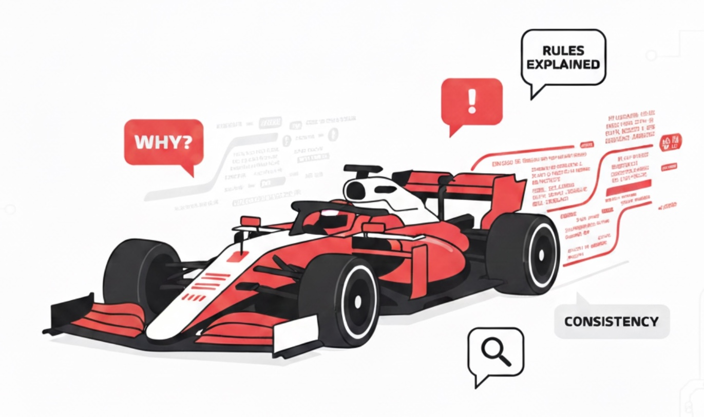
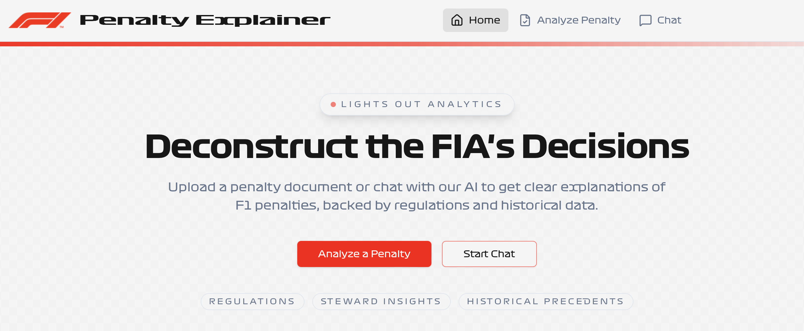
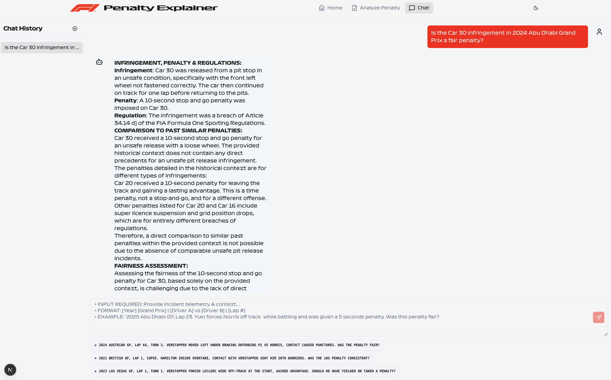

# ac215_FormulaOnePenaltyTool



## Team Members
* Beatrice Chen
* Bhargav Kosaraju
* Lorraine Bichara Assad

## Group Name
Formula One Penalty Tool

## Project Organization

```
├── README.md
├── reports
│   └── Milestone1.pdf
│   └── Milestone3.pdf
│   └── Milestone4-ApplicationDesignDocument.pdf
└── src
│   ├── datapipeline
│   ├── deployment
│   ├── finetune
│   ├── frontend
│   ├── rag
│   └── api
└── tests
│   └── integration
│   └── system
│   └── unit
├── Dockerfile
├── docker-compose.yml
├── docker-entrypoint.sh
├── docker-shell.sh
├── pyproject.toml
├── pytest.ini
├── input.dvc
├── .dvcignore
├── .gitignore
└── uv.lock
```
---

## Project
This project aims to make Formula 1 penalties more transparent and understandable for fans. Governed by the FIA, F1 penalties often appear inconsistent due to the complexity of the Sporting and Technical Regulations. This application takes a given race penalty and provides an accessible explanation of the infringement, referencing the official FIA regulations. It also analyzes the fairness of the penalty by comparing it to historical cases, helping users better grasp how penalties are determined and whether they align with past precedents.





## How to run locally

### Pre-Requisites
1. Have a GCP project. Code is set up to use f1penaltytool as a project name. If using a different one, GCP_PROJECT needs to be updated in docker-compose.yml.
2. Have a storage bucket with decision and regulation PDF documents. To get these, see [Data Pipeline README](src/datapipeline/README.md) for information on how to scrape the documents. 
3. Have a service account and access to a key and corresponding secrets (these should be stored in /app/secrets/f1penaltytool.json)

---
1. Clone the project
2. On main directory, run `docker compose up`
3. Access http://localhost:9000/docs to see the API.
4. If you're a first time user, you'll have to run the `/chunk`, `/embed`, and `/store` APIs to create the chunkings and embeddings and save them in ChromaDB.
5. If you're a returning user, you'll have to run `/store` the first time you bring up a new container.
6. Access http://localhost:3001 to test the project using the frontend.

## Milestone 1
See Milestone 1 [here](reports/Milestone1.pdf).


## Milestone 2
In this milestone, we have set up the core infrastrucutre of the project. This include setting up the environment, as well as a data collection pipeline and a RAG setup.

### Data
[Data Pipeline README](src/datapipeline/README.md)

### RAG
[RAG README](src/rag/README.md)


## Milestone 3
See the Milestone 3 midterm presentation [here](reports/Milestone3.pdf).

For this milestone, we applied feedback received in Milestone 2 including:
- Removed data files from GitHub repository
- Add a dedicated folder for reports/documents (MS1 proposal, MS3 midterm presentation)
- Include repository structure in the main README
- Updated the UI mock up, see [here](https://twine-claw-08738571.figma.site)

## Milestone 4
### Application Design
[Application design doc](reports/Milestone4-ApplicationDesignDocument.pdf)

### Data Versioning
[Data Versioning README](src/datapipeline/DATAVERSIONING_README.md)

### Frontend
[Frontend README](src/frontend/frontend-template/README.md)

### API
[API README](src/api/README.md)

### Model Fine-Tuning
[Fine-Tuning README](src/finetune/README.md)

### CI and Testing
[Testing README](tests/README.md)

## Milestone 5
### Deployment
[Deployment README](src/deployment/README.md)

### Blog
[Blog](https://medium.com/institute-for-applied-computational-science/racing-toward-transparency-using-ai-to-explain-f1-penalties-b33122ed7f8d)

### Video
[Video](https://bit.ly/FormulaOnePenaltyToolVideo)
