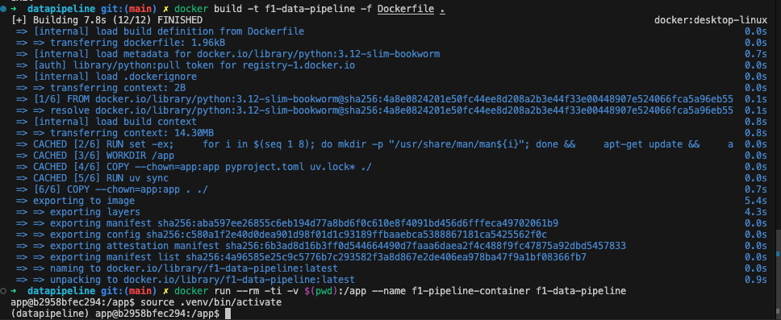
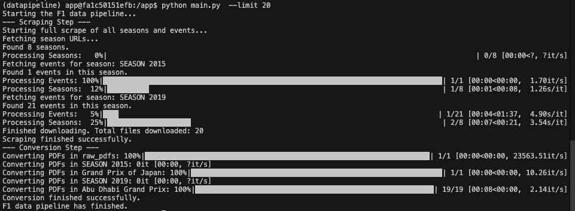

# F1 Data Pipeline

This directory contains a standalone data pipeline for scraping and processing Formula 1 documents from the official FIA website.

## Overview

The pipeline is designed to build a comprehensive dataset of [F1 race control documents](https://www.fia.com/documents/championships/fia-formula-one-world-championship-14/season/). It automates the process of downloading official PDF documents from the FIA website and converting them into plain text files, making them suitable for analysis and use in a Retrieval-Augmented Generation (RAG) model.

The entire process is orchestrated by `main.py`, which utilizes two core modules: `scraper.py` and `converter.py`.

## Project Structure

- **`main.py`**: The entry point for the data pipeline. It parses command-line arguments to run the scraping and/or conversion steps.
- **`scraper.py`**: Contains the `FIA_Scraper` class, which handles the web scraping process. It navigates the FIA documents website, finds all F1 seasons and events, and downloads the associated PDF documents.
- **`converter.py`**: Contains the `PDF_Converter` class, which is responsible for converting the downloaded PDF files into plain text (`.txt`) files.
- **`data/`**: The output directory for the pipeline. It is organized into two subdirectories:
    - `raw_pdfs/`: Stores the original PDF files downloaded by the scraper.
    - `processed_txt/`: Stores the text files generated by the converter.

## Data Directory Structure

After running the pipeline, the `data` directory will have the following structure. The pipeline preserves the `SEASON/EVENT` hierarchy from the FIA website.

```
data/
├── raw_pdfs/
│   └── SEASON 2024/
│   │   └── Monaco Grand Prix/
│   │       ├── doc_1_-_stewards_decision.pdf
│   │       └── doc_2_-_summons.pdf
|   └── Regulations/
└── processed_txt/
    └── SEASON 2024/
        └── Monaco Grand Prix/
            ├── doc_1_-_stewards_decision.txt
            └── doc_2_-_summons.txt
```

**Note**: pdf files under `Regulations` contains the lastest version of the [FIA Formula One Regulations](https://www.fia.com/regulation/category/110) among all categories. These files are obtained manually directly from the website due to the small amount. Future iterations of implementation plan may automate this process.

## Local Setup

This project uses `uv` for Python environment and package management.

1.  **Navigate to the pipeline directory:**
    ```bash
    # From the root of the project
    cd src/datapipeline
    ```

2.  **Create and activate the virtual environment:**
    ```bash
    uv venv datapipeline
    source datapipeline/bin/activate
    ```

3.  **Install dependencies:**
    ```bash
    uv pip sync -r requirements.txt
    ```

## Running the Pipeline Locally

All commands should be run from the `src/datapipeline` directory.

-   **Scrape Only:**
    To run only the scraper and download all documents:
    ```bash
    python main.py --steps scrape
    ```
    To download a limited number of documents for testing:
    ```bash
    python main.py --steps scrape --limit 10
    ```

-   **Convert Only:**
    To run only the converter on already downloaded PDFs:
    ```bash
    python main.py --steps convert
    ```

-   **Full Run:**
    To run the entire scrape and convert pipeline:
    ```bash
    python main.py
    ```

## Containerized Usage with Docker

The data pipeline can be built and run as a containerized application.

1.  **Build the Docker image:**
    From this directory (`src/datapipeline`), run:
    ```bash
    docker build -t f1-data-pipeline -f Dockerfile .
    ```

2.  **Run the container:**
    This command will start the container and give you a shell. The local `data` directory is mounted into the container at `/app/data` to ensure that the downloaded and processed files are saved to your host machine.
    ```bash
    docker run --rm -ti -v $(pwd):/app --name f1-pipeline-container f1-data-pipeline
    ```

    

3.  **Run a specific step in the container:**
    From the shell inside the container, you can run the pipeline with specific arguments. For example, to run only the scraper with a limit:
    ```bash
    python main.py --steps scrape --limit 20
    ```

    
