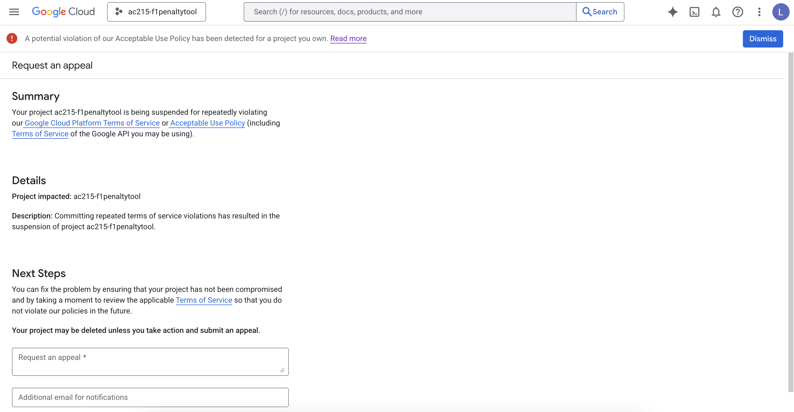
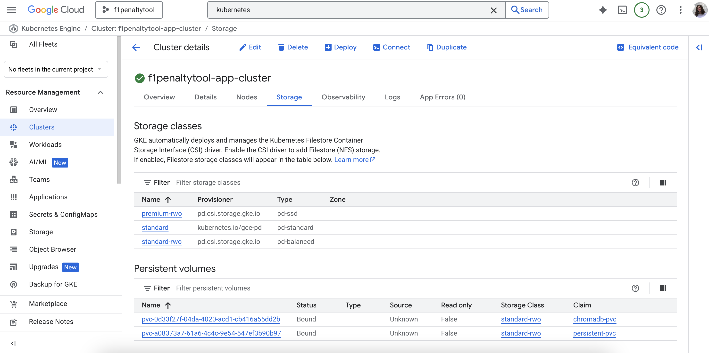
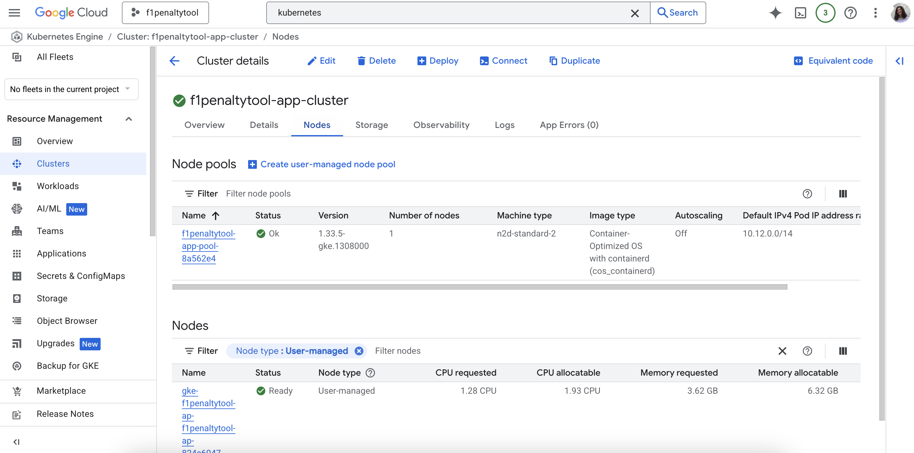
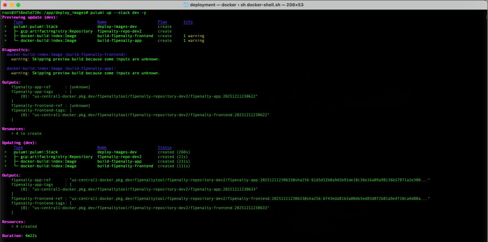
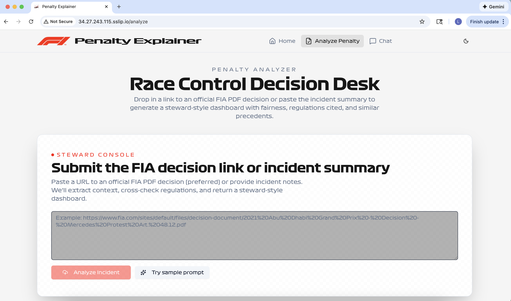
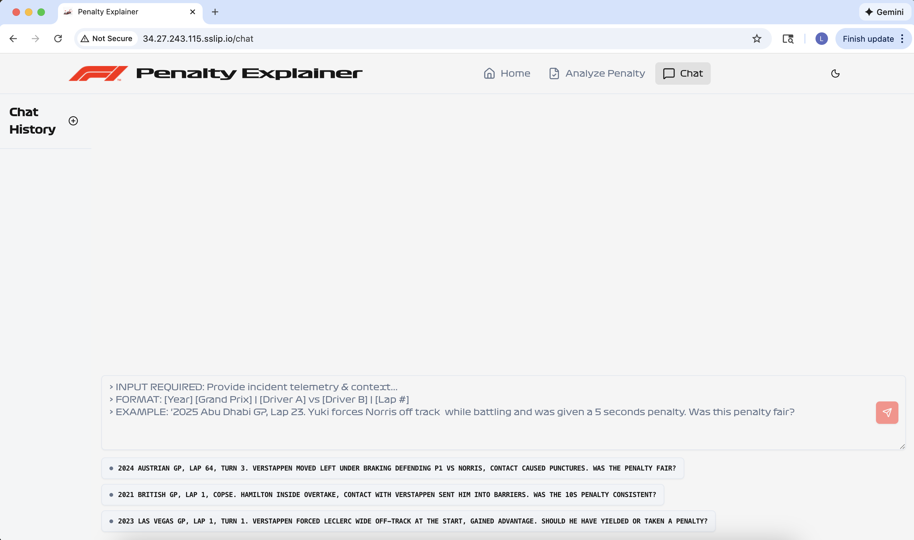

# Deployment

This document summarizes the deployment infrastructure we built for the F1 Penalty Tool application. The deployment consists of three main components that work together.

## Deployment History

The project was initially deployed successfully, but Google Cloud Platform suspended our entire project due to terms of service violations, which required us to rebuild everything from scratch. We recreated the GCP project, rebuilt the storage bucket infrastructure used for RAG, and redeployed all services. Due to time constraints, we did not include the fine-tuned model (from MS4) in the rebuilt project, but we successfully restored the core application functionality with the default model (using RAG) and redeployed the entire stack.

Screenshot of our GCP project suspended:



After re-building and re-deploying:













## Prerequisites: Docker Environment Setup

**Before running any deployment commands, the Docker environment must be set up first.**

We use a Docker container that provides all the necessary tools, environment variables, and mounted volumes for running Pulumi deployments. This container includes:
- Pulumi CLI and plugins
- GCP SDK (gcloud)
- Docker-in-Docker support for building images
- Properly configured environment variables (GCP project, region, zone)
- Mounted secrets and SSH keys
- Access to the project root and all source code

**Command to run first:**
```bash
cd src/deployment
sh docker-shell.sh
```

This script:
- Builds a Docker image with all deployment tools if it doesn't exist
- Starts a container with all necessary mounts and environment variables
- Drops you into a shell inside the container where all deployment commands should be run

**Important:** All subsequent deployment commands (`pulumi up`, etc.) should be run inside this Docker container shell, not on your host machine.

---

## Overview

We implemented a three-step deployment process:

1. **Docker Environment Setup** - Start the deployment container (run `sh docker-shell.sh`)
2. **Image Building** - Docker images are built and stored in Google Cloud Artifact Registry
3. **Infrastructure Deployment** - Two deployment options were implemented (Single VM and Kubernetes)
4. **Application Access** - Services are exposed via public IP addresses or custom domains

---

## Image Building (`deploy-images`)

**What we built:** A Pulumi stack that builds Docker images from the application code and pushes them to Google Cloud's Artifact Registry.

**Implementation details:**
- Builds Docker images for both the API/backend service and the frontend
- Uses Google Cloud Artifact Registry to store images
- Tags images with timestamps for versioning
- Images are built using the Dockerfile in the deployment directory

**Commands used (inside Docker container):**
```bash
# First, from host machine:
cd src/deployment
sh docker-shell.sh

# Then, inside the Docker container:
pulumi stack select deploy-images
pulumi up
```

**What it creates:**
- Docker images for the API/backend service
- Docker images for the frontend web application
- Artifact Registry repository in Google Cloud
- Image references that are used by the deployment stacks

**Timing:** Typically takes 5-10 minutes depending on build complexity and upload speed.

---

## Single VM Deployment (`deploy-single-vm`)

**What we built:** A complete single-server deployment where all services run on one virtual machine using Docker containers.

**Implementation details:**
- Creates a single Compute Engine VM instance in Google Cloud
- Provisions the VM with Docker and necessary system dependencies
- Deploys all services as Docker containers on the same VM:
  - API/backend service (FastAPI)
  - Frontend service (Next.js)
  - Vector database (ChromaDB)
- Sets up persistent disk storage for data
- Configures Nginx as a reverse proxy/load balancer
- Exposes services via a public IP address

**Commands used (inside Docker container):**
```bash
# First, from host machine:
cd src/deployment
sh docker-shell.sh

# Then, inside the Docker container:
pulumi stack select deploy-single-vm
pulumi up
```

**What it creates:**
- One virtual machine instance
- Persistent disk for data storage
- Docker network for container communication
- Nginx webserver for routing
- Public IP address for access

**Characteristics:**
- Simpler architecture, easier to understand and debug
- Lower cost for small-scale deployments
- Single point of failure (if VM goes down, everything goes down)
- Manual scaling required (need to resize VM or add more VMs manually)
- Good for development, testing, or small production workloads

**Timing:** Typically takes 10-15 minutes for full deployment.

---

## Kubernetes Deployment (`deploy-k8s`)

**What we built:** A production-ready Kubernetes deployment on Google Kubernetes Engine (GKE) with proper networking, load balancing, and service orchestration.

**Implementation details:**
- Creates a GKE cluster (zonal, single-zone for cost efficiency)
- Sets up VPC network, subnets, and NAT gateway
- Deploys services as Kubernetes pods:
  - API service with proper environment variables and secrets
  - Frontend service
  - Vector database (ChromaDB)
- Configures Nginx Ingress Controller for load balancing
- Sets up separate Ingress resources for API and frontend routing
- Implements Workload Identity for secure service account access
- Mounts GCS buckets using gcsfuse for data access
- Configures persistent volumes for ChromaDB data

**Commands used (inside Docker container):**
```bash
# First, from host machine:
cd src/deployment
sh docker-shell.sh

# Then, inside the Docker container:
pulumi stack select deploy-k8s
pulumi up
```

**What it creates:**
- Kubernetes cluster in Google Cloud
- VPC network with subnets
- NAT gateway for outbound internet access
- Kubernetes namespace for application resources
- Deployments for API, frontend, and vector database
- Services for internal service discovery
- Ingress resources for external access
- Load balancer with public IP address
- Service accounts with appropriate IAM roles

**Key features:**
- API accepts both `/query/` and `/api-service/query/` endpoints (no ingress rewrite needed)
- Separate Ingress resources for API and frontend to avoid routing conflicts
- Automatic health checks and pod restarts
- Can scale horizontally by adding more pods
- Better isolation between services

**Characteristics:**
- More scalable architecture
- Better suited for production workloads
- Automatic health monitoring and recovery
- Higher cost due to cluster management overhead
- Requires more GCP quota (especially for regional deployments)
- More complex to troubleshoot

**Timing:** Typically takes 15-20 minutes for full cluster creation and deployment.

---

## Deployment Architecture Decisions

### Why Two Deployment Options?

We implemented both Single VM and Kubernetes deployments to provide flexibility:
- **Single VM** for simpler use cases, development, or cost-sensitive scenarios. This is what we started with to initially test our deployment pipeline.
- **Kubernetes** for production workloads that need scalability and high availability. Used at the end for the final milestone deliverable.

### Image Building First

Images must be built before deployment because:
- Both deployment methods reference pre-built images from Artifact Registry
- This separation allows rebuilding images independently of infrastructure
- Images can be reused across multiple deployments

### Kubernetes Routing Solution

For the Kubernetes deployment, we solved the API routing issue by:
- Adding routes in FastAPI that accept `/api-service/query/` directly
- Using separate Ingress resources for API and frontend
- Avoiding complex ingress rewrite rules that weren't working reliably with the F5 nginx ingress controller

This approach is simpler and more maintainable than trying to configure path rewriting in the ingress layer.

---

## Access and URLs

After deployment, the application is accessible via:

- **Single VM:** `http://<VM_IP_ADDRESS>:3000`
- **Kubernetes:** `http://<LOAD_BALANCER_IP>.sslip.io` or custom domain if configured

The Pulumi stack outputs include the IP addresses and URLs after successful deployment.

---

## Common Operations

All of these commands should be run inside the Docker container (after running `sh docker-shell.sh`):

**Preview changes:**
```bash
pulumi preview
```

**Deploy/update infrastructure:**
```bash
pulumi up
```

**View current deployment outputs:**
```bash
pulumi stack output
```

**Destroy all resources:**
```bash
pulumi destroy
```

---

## Implementation Notes

- **Custom Domain:** Kubernetes deployment supports custom domains (configured in `deploy_k8s/__main__.py`)
- **SSL/HTTPS:** SSL certificates are configured via cert-manager but may take time to provision
- **Cost Considerations:** Kubernetes deployment has higher ongoing costs due to cluster management
- **Scaling:** Kubernetes supports horizontal pod autoscaling; Single VM requires manual VM resizing
- **Data Persistence:** Both deployments use persistent storage for ChromaDB data
- **GCS Integration:** Kubernetes deployment mounts GCS buckets directly using gcsfuse

---

## Deployment Order

The deployment process follows this order:

1. **First:** Run `sh docker-shell.sh` from the host machine to start the deployment container
2. **Then:** Inside the container, run `deploy-images` to build and upload Docker images
3. **Finally:** Inside the container, run either `deploy-single-vm` OR `deploy-k8s` to deploy the application

Images only need to be rebuilt when application code changes. Once images exist in Artifact Registry, they can be reused for multiple deployments. The Docker container can be reused for multiple deployments - you don't need to restart it each time.
