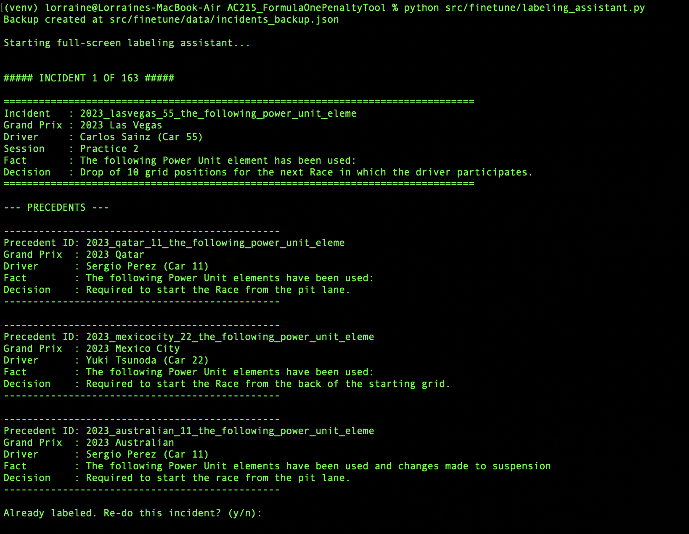
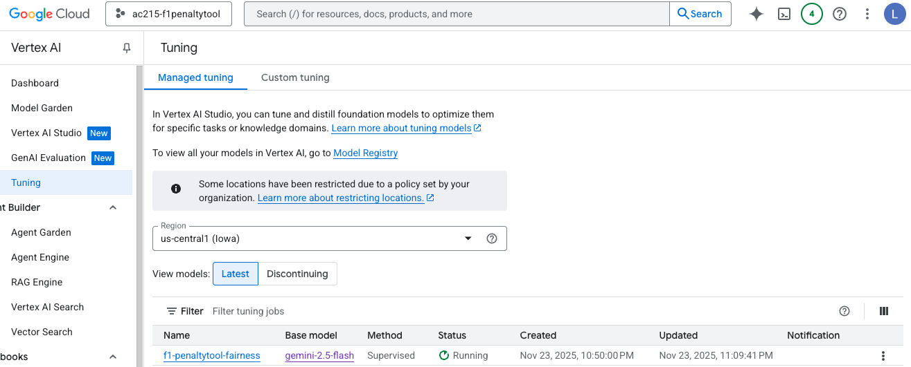
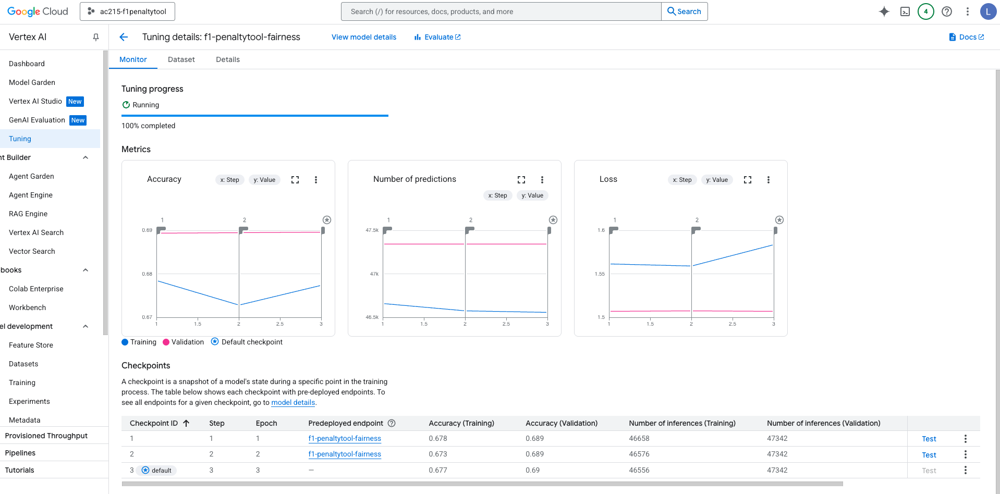
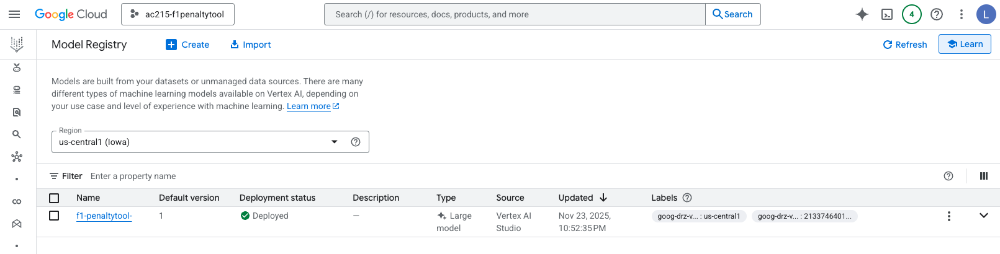
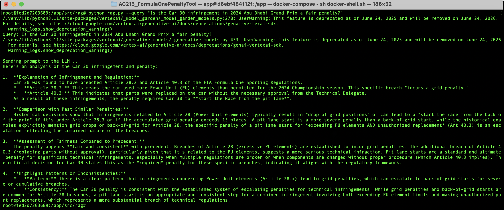

# F1 Fine Tuning

This directory contains the full workflow for preparing and fine-tuning a Gemini 2.5 Flash model to perform structured F1 Penalty Fairness Analysis.

The pipeline transforms FIA race-control PDFs → structured incidents → labeled gold answers → JSONL datasets → Gemini-compatible training data → a fine-tuned model to use inside the RAG pipeline.

## Summary
There were 2 areas where we figured we could fine-tune a model for:
- Style of reasoning and structure of explanations (how to cite regulations in a standardized way, etc.)
- Improve fairness analysis reasoning

Ultimately we went with the fairness analysis part, as it would provide more value for our project. It reasons based on precedent, uses a consistent framework for fairness scoring, and provides a judgement based on historical patterns. Fine-tuning for this would require some additional work while creating the test data, of manually labeling penalties as fair or not, so this was done based on judgement.

Since we used Gemini 2.5-Flash for Milestone 2, we decided to keep using this model and tune it using Vertex AI's capabilities as listed [here](https://docs.cloud.google.com/vertex-ai/generative-ai/docs/models/gemini-use-supervised-tuning). The technique used is supervised fine fine-tuning using lightweight adapters. Some benefits of this technique include lower compute costs and faster training while still delivering good results.

## Logs
Logs can be found [here](./logs).

## Directory Structure
```bash
finetune/
│
├── data/
│   ├── incidents.json
│   ├── train.jsonl
│   ├── valid.jsonl
│   ├── convert_for_gemini.py
│   └── make_jsonl.py
├── parse_fia_documents.py
├── build_incidents_dataset.py
├── labeling_assistant.py
└── README.md
```

## Process

### 1. Parse FIA Penalty PDFs
After the datapipeline scrapes FIA Stewards' documents, these PDFs were then comnverted into structured JSOn records

```bash
python parse_fia_documents.py
```

This script loads each FIA PDF, extracts driver, car, session, fact, decision and derives a unique incident ID. Then collects precedent incidents (similar rule types) and outputs `data/incidents_raw.json`.

### 3. Label incidents with gold fairness answers
This step consists of manually annotating each incident with a structured, high-quality fairness explanation using:

```bash
python labeling_assistant.py
```
The tool:
- Displays the incident and 3 precedents
- Opens a TextEdit template for writing the fairness judgement
- Saves the completed annotation into `incidents.json` with a `gold_answer` field



101 incidents were labeled.

### 4. Create the initial train/validation JSONL files
Gemini training requires supervised (input->output) example pairs.
This step splits labeled incidents and produces JSONL.
```bash
python make_jsonl.py
```

Outputs:
```bash
data/train.jsonl
data/valid.jsonl
```

### 5. Convert JSONL -> Gemini Console Format
Gemini fine-tuning from the GCP console requires the JSONLs to be in a particular format.

```bash
python convert_for_gemini.py
```

Outputs:
```bash
data/train_converted.jsonl
data/valid_converted.jsonl
```

### 6. Upload converted files to GCS
The JSONL files were uploaded to a GCS Storage Bucket.

Training dataset →
`gs://f1penaltydocs/fine_tuning/train.jsonl`

Validation dataset →
`gs://f1penaltydocs/fine_tuning/valid.jsonl`

### 7. Fine-Tune Gemini 2.5 Flash (Using Vertex AI Console)
Fine-tuning parameters used:

We used a conservative, production-oriented configuration (3 epochs, small LR, default adapter size) to efficiently adapt Gemini 2.5 Flash to our task while preserving the stability and general capabilities of the base model.
| Setting    | Value | Rationale |
| -------- | ------- | ------- |
| Epochs  | 3    | Wanted model to see full training set multiple times but avoid overfitting.    |
| Learning rate multiplier | 1e-5     | To preserve the general abilities of the model but nudging it to our specific task.    |
| Adapter size    | Default (≈ LoRA rank 64)    | Relied on Vertex AI's default adapter size which is comparable to a LoRA rank of 64. Sweet spot between keeping the number of trainable parameters small to avoid high costs but enough to have a good model.    |




### 8. Retrieve tuned model
Once ftraining is complete, the model appears in Vertex AI Model Registry, and the ID (endpoint resource name) can be copied to pass into the RAG pipeline for inference.



### 9. Use the tuned model (Inference)
Inside the RAG query stage, replace the base model with the tuned model.

This tuned model:
- Consumes RAG-retrieved FIA regulations + precedent incidents
- Produces a structured, concise fairness analysis
- Outperforms base models on F1-specific reasoning

