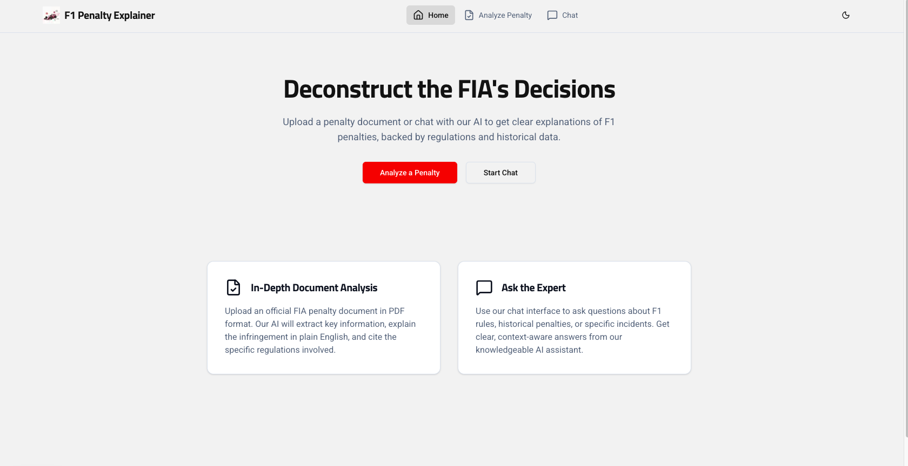
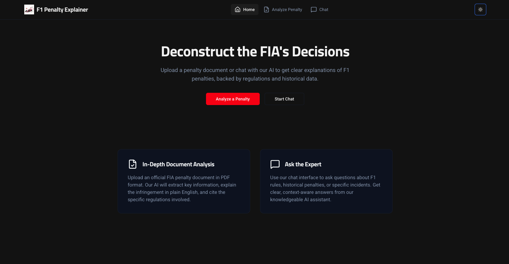
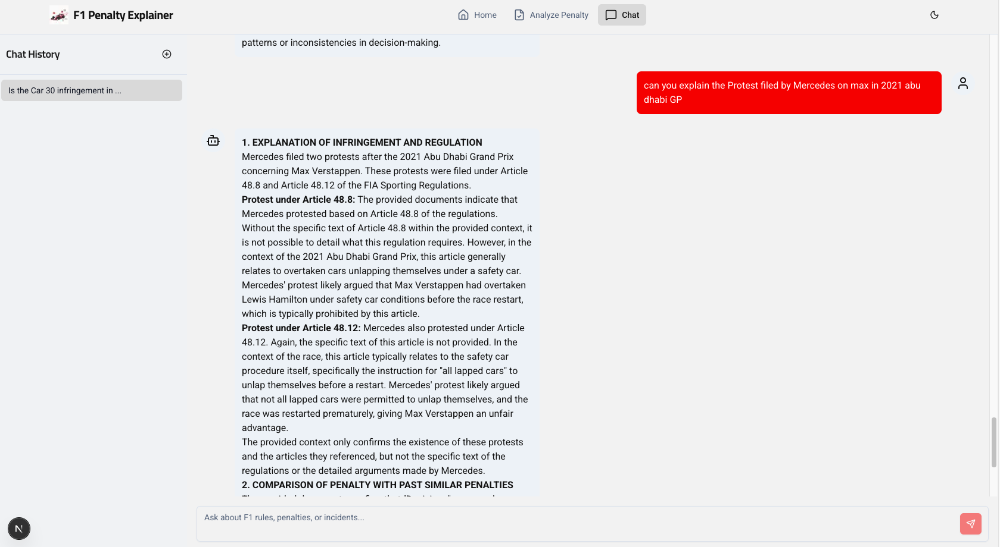
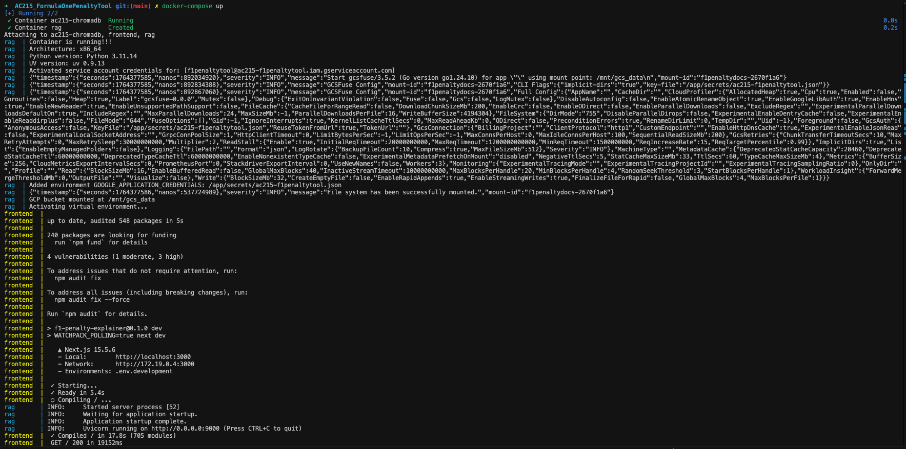

# F1 Penalty Explainer - Frontend

This directory contains the source code for the F1 Penalty Explainer frontend application. It is a [Next.js](https://nextjs.org/) application that provides a user interface for interacting with the Formula 1 penalty analysis backend.

## Features

*   **Interactive Chat**: A chat interface to ask questions about F1 rules, penalties, and incidents in natural language.
*   **Penalty Document Analysis**: A page to upload and analyze official FIA penalty documents.
*   **Theming**: Includes both light and dark mode, and is responsive.
*   **Component-Based UI**: Built with reusable React components using [shadcn/ui](https://ui.shadcn.com/).

## Tech Stack

*   **Framework**: [Next.js](https://nextjs.org/)
*   **Language**: JavaScript (React)
*   **Styling**: [Tailwind CSS](https://tailwindcss.com/)
*   **UI Components**: [shadcn/ui](https://ui.shadcn.com/)
*   **API Communication**: [Axios](https://axios-http.com/)
*   **Markdown Rendering**: [React Markdown](https://github.com/remarkjs/react-markdown)

## Project Structure

```
frontend/frontend-template/
├── .env.development
├── .env.production
├── .gitignore
├── assets/
│   ├── docker-compose.png
│   ├── homepage-dark.png
│   ├── homepage.png
│   └── ui-running.png
├── components.json
├── docker-shell.sh
├── Dockerfile
├── Dockerfile.dev
├── jsconfig.json
├── next.config.js
├── package-lock.json
├── package.json
├── postcss.config.js
├── public/
│   └── assets/
│       ├── logo.jpeg
│       └── logo.svg
├── README.md
├── src/
│   ├── app/
│   │   ├── analyze/
│   │   │   └── page.jsx
│   │   ├── chat/
│   │   │   └── page.jsx
│   │   ├── globals.css
│   │   ├── layout.jsx
│   │   ├── not-found.jsx
│   │   └── page.jsx
│   ├── components/
│   │   ├── analyze/
│   │   │   ├── AnalysisResult.jsx
│   │   │   ├── PenaltyOverviewCard.jsx
│   │   │   ├── PenaltyUploader.jsx
│   │   │   └── RegulationViewer.jsx
│   │   ├── chat/
│   │   │   ├── ChatHistorySidebar.jsx
│   │   │   ├── ChatInput.jsx
│   │   │   ├── ChatMessage.jsx
│   │   │   └── ChatPage.jsx
│   │   ├── home/
│   │   │   ├── FeaturesSection.jsx
│   │   │   ├── HomePage.jsx
│   │   │   └── HeroSection.jsx
│   │   ├── layout/
│   │   │   ├── Footer.jsx
│   │   │   ├── Header.jsx
│   │   │   └── ThemeToggle.jsx
│   │   └── ui/
│   │       ├── avatar.jsx
│   │       ├── badge.jsx
│   │       ├── button.jsx
│   │       ├── card.jsx
│   │       ├── checkbox.jsx
│   │       ├── dialog.jsx
│   │       ├── dropdown-menu.jsx
│   │       ├── input.jsx
│   │       ├── scroll-area.jsx
│   │       ├── select.jsx
│   │       ├── separator.jsx
│   │       ├── sheet.jsx
│   │       ├── textarea.jsx
│   │       ├── toast.jsx
│   │       └── toaster.jsx
│   ├── hooks/
│   │   └── use-toast.js
│   └── lib/
│       ├── Common.js
│       ├── DataService.js
│       ├── SampleData.js
│       └── utils.js
```


## Getting Started

Follow these instructions to set up and run the application.

### Workflow

*Note: additional automation will be implementated to optimize the workflow*

1.  **Start Backend Services**: From the project root, run the root `docker-shell.sh` to set up the `rag` and `chromadb` containers.
    ```bash
    sh docker-shell.sh
    ```

2.  **Set up Frontend Container**: In a new terminal, navigate to the `src/frontend/frontend-template` directory and run its `docker-shell.sh`.
    ```bash
    cd src/frontend/frontend-template
    sh docker-shell.sh
    ```

3.  **Populate the Database via API**: Open your browser and navigate to the backend's API documentation at `http://localhost:9000/docs`. Use the interface to run the `/store` endpoints in that order. This is a one-time setup step.

4.  **Start Full Application with Docker Compose**: Go back to the project root directory and run `docker-compose up`.
    ```bash
    docker-compose up
    ```

5.  **Access the Application**: Open your browser and navigate to `http://localhost:3001`to access the UI.


## Evidence of Running Components

Below are screenshots showing the frontend application and its components in action.

### Home Page (Light Mode)

This screenshot shows the application's home page with the light theme enabled.



### Home Page (Dark Mode)

This screenshot shows the application's home page with the dark theme enabled.



### Chat Interface

This screenshot shows the main chat interface of the application.



### Docker Compose Services

This screenshot shows the `docker-compose` services running, including the frontend, backend (`rag`), and database (`chromadb`).


