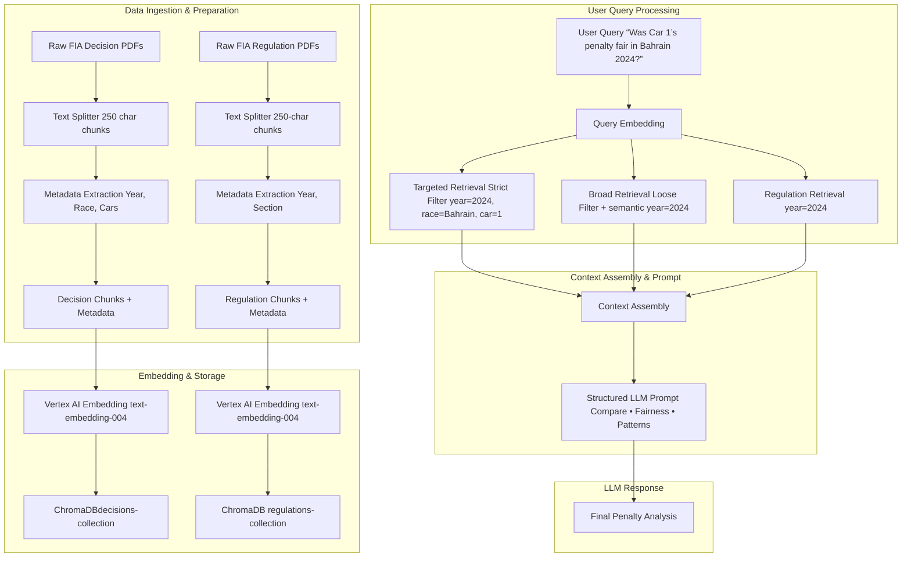
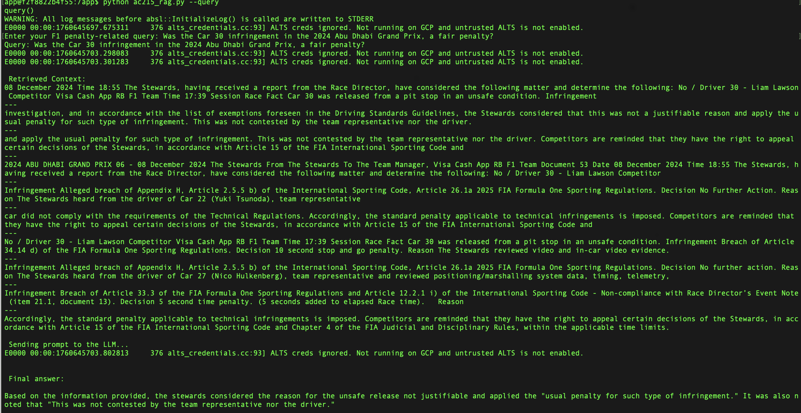

# F1 RAG

This directory contains a RAG pipeline.

## Overview
This project builds a Two-Level Retrieval-Augmented Generation (RAG) pipeline designed to analyze and explain Formula 1 race penalties. It uses FIA steward decision documents to provide human-readable explanations and fairness assessments of penalties.

The pipeline automates the process of converting FIA PDF documents into structured, searchable text, generating embeddings with Vertex AI and storing them in a ChromaDB vector database for semantic retrieval. Users can query the system in natural language and ask questions such as: "Was the Car 30 infringement in the 2024 Abu Dhabi Grand Prix fair?”. The model will respond with context-grounded insights derived directly from FIA documentation.

The workflow is structured in three phases: Data Preparation, Embedding/Storage, and the Dual-Query Retrieval Core.

### 1. Data Ingestion and Preparation

This phase transforms unstructured PDF documents into clean, structured data chunks ready for embedding.

* **Data Preparation:** Raw PDF files (Decision Documents and Regulations) are processed and converted into text chunks. A **Recursive Character Splitter** is used to create small, manageable units (e.g., 250 characters with overlap), which are saved as JSONL files.

* **Advanced Metadata Tagging:** This is a crucial step for accurate filtering and analysis:
    * Document filenames are parsed to extract core structured metadata (`year`, `location`, `car_num`).
    * The document content itself is parsed to identify and store all involved cars (e.g., `'1, 2'`) in a specialized metadata field called `all_involved_cars`.

### 2. Embedding and Storage (Vector Database Population)

The prepared data is converted into vectors and stored for fast similarity search.

* **Embedding Generation:** Chunks and their enriched metadata are converted into high-dimensional vectors using **Vertex AI's `text-embedding-004`** model, typically processed in batches (e.g., Batch 250) for efficiency.
* **Vector Storage:** The embeddings are stored in two separate **ChromaDB Collections**:
    * `Decision Documents Collection` (for penalty rulings, summons, and infringement notices).
    * `Regulation Documents Collection` (for Sporting and Technical Regulations).

### 3. Dual-Query Retrieval Core (The Analysis Engine)

This phase executes the complex retrieval logic necessary to satisfy the requirements for comparison and fairness assessment. 

* **User Query Processing:** When a user asks a question (e.g., "Was Car 1's penalty fair in Bahrain 2024?"), the system first converts the query into a vector embedding.

* **Two-Stage Context Retrieval:** Two distinct searches are run against the Decision Collection to achieve high precision *and* high recall:
    * **Targeted Search (High Precision):** Uses a **strict ChromaDB `where` filter** (e.g., `year: 2024` AND `car_number: 30`) to precisely locate and retrieve the specific document under review.
    * **Broad Search (High Recall):** Without using any **`where` filter**, relying primarily on semantic similarity to pull historical precedents from *all* years and cars that discuss similar infractions.

* **Regulation Context Retrieval:** A dedicated search queries the Regulation Collection, applying a **year-specific filter** (e.g., `year: 2024`) to ensure the cited rules are current for the incident's season.

* **Context Assembly:** All verified context chunks (Specific Case, Historical Precedents, and Year-Specific Regulations) are compiled. Each chunk is clearly labeled for the LLM to easily distinguish between the specific case and the comparative data.

* **LLM Analysis:** The compiled context is injected into a structured **System Prompt** along with the user's question. The LLM (e.g., Gemini 2.5) uses this structured input to deliver the required analytical outputs:
    1.  Clear explanation of the infringement and regulation.
    2.  Comparison of the penalty against historical precedents.
    3.  Assessment of fairness.
    4.  Highlighting of patterns or inconsistencies.

---

### High level diagram


# Design Decisions
### Chunking
We are using the recursive character splitting mechanism to split on a hierarchy of separators (e.g., \n\n for paragraphs, then \n for new lines, then space, etc.). This is crucial for chunking the documents which are organized with sections, clauses, and numbered paragraphs. It preserves the author's logical structure, which is vital for the target context.

FIA decision documents generally follow a rigid, often numbered structure (e.g., "1. Factual Background," "1.1. Incident Description," "2. Decision Rationale," etc.). Because of this reason, we chose to use this method of chunking for our project.

### Metadata
The primary advantage of storing metadata in the vector database for the embeddings is to help in filtering and to add context to the search results using the additional contextual information.

Using **Metadata Filtering** (via ChromaDB's `where` clause) is a crucial design choice for this F1 RAG system because it provides the necessary **precision and control** that pure semantic search lacks. By storing structured tags like `year`, `car_number`, and `location`, the system can execute highly targeted retrieval for the specific case under review (e.g., Car 30's 2024 penalty), while simultaneously performing a broad, semantic search for historical comparison. This dual-query strategy ensures that the LLM receives both the exact factual details required for the specific ruling and a comprehensive set of relevant precedents from other cars/years, enabling the  fairness analysis demanded by the project's requirements.

# Running the Pipeline on a local setup
All commands should be run from the `src/rag` directory.

-   **Start the container:**
    ```bash
    sh docker-shell.sh
    ```

-   **Run the entire RAG pipeline:**
    ```bash
    python ac215_rag.py --all
    ```

-   **Parse and chunk the documents:**
    ```bash
    python ac215_rag.py --chunk
    ```

-   **Create embeddings for the chunks:**
    ```bash
    python ac215_rag.py --embed
    ```

-   **Store the embeddings in ChromaDB:**
    ```bash
    python ac215_rag.py --store
    ```

-   **Make a query to ChromaDB and using the queried embeddings interact with LLM:**
    ```bash
    python ac215_rag.py --query
    ```

## Evidence of Running Instances
- **Running the container**


- **Parsing and chunking documents**


- **Create embeddings for the chunks**


- **Store the embeddings in ChromaDB**


- **Query ChromaDB**


